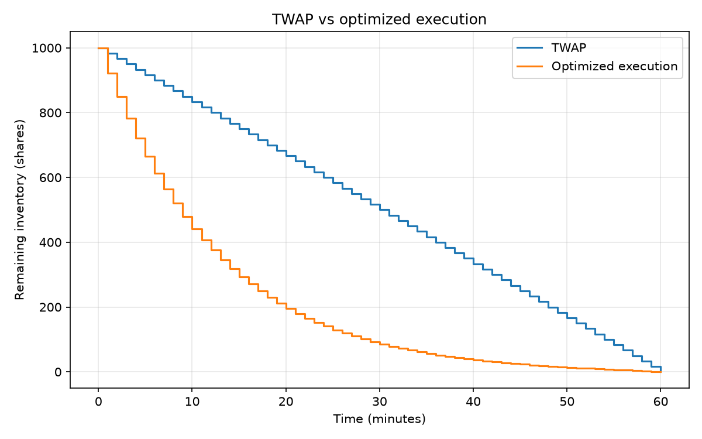
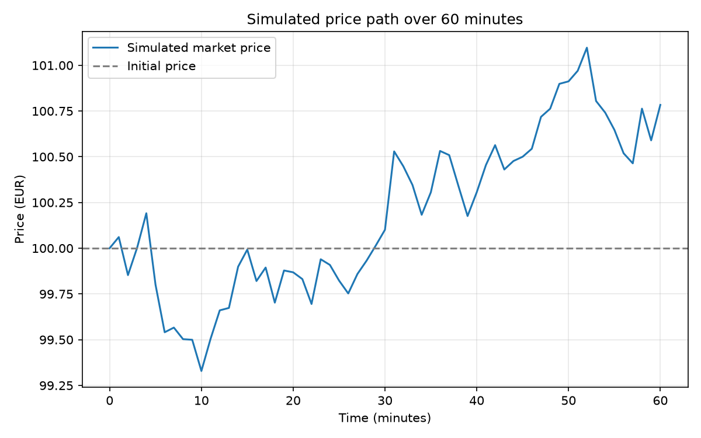

# Mean-Field Games for Optimal Execution

Work in progress. The current implementation studies single-agent optimal
execution with temporary price impact and inventory risk.
Mean-field interactions are a planned extension and are not implemented yet.

## Model

A trader sells 1,000 shares over a maximum horizon of 60 minutes.

- Arithmetic Brownian market price with zero drift
- Initial price: EUR 100 per share
- Volatility: 0.20 EUR per square-root minute
- Linear temporary impact: execution price = market price - eta * trading rate
- Impact coefficient eta: 0.006 EUR * minute / share^2
- Sales occur at the end of each one-minute interval
- Fractional shares are allowed

Parameters are illustrative, not calibrated to market data.

## Strategies

1. TWAP: equal sales over 60 minutes.
2. Accelerated execution: equal sales over the first 30 minutes.
3. Optimized execution: a deterministic schedule minimizing expected
   implementation shortfall plus lambda times its variance.

Implementation shortfall is initial inventory times initial price minus
total execution revenue. A negative value means revenue exceeds this benchmark.

Risk aversion lambda is 0.001 per EUR.
The mean-variance score is a decision criterion, not an actual cash expense.

## Results

Monte Carlo evaluation uses 10,000 shared price paths with random seed 42.

| Strategy | Mean shortfall (EUR) | Standard deviation (EUR) | Mean-variance score (EUR) |
|---|---:|---:|---:|
| TWAP, 60 minutes | 101.19 | 898.73 | 908.91 |
| Accelerated, 30 minutes | 199.21 | 643.68 | 613.53 |
| Optimized | 243.91 | 512.71 | 506.78 |

The optimized schedule accepts higher expected impact costs to reduce
execution risk. It achieves the lowest score among these strategies
for the specified model and risk aversion.

The schedule is computed from model parameters, without using future
simulated prices.

## Validation

- TWAP theoretical mean shortfall: EUR 100.
- TWAP theoretical standard deviation: EUR 905.60.
- Simulated TWAP standard deviation: EUR 898.73.
- SLSQP optimization checked against the discrete analytical solution.
- Maximum difference per trade: approximately 0.000388 shares.
- Optimized theoretical score: EUR 510.360666.

Monte Carlo estimates fluctuate around theoretical values.

## Figures

## Installation

Requires Python 3 and the dependencies listed in requirements.txt.

    python3 -m venv .venv
    source .venv/bin/activate
    python -m pip install -r requirements.txt

## Run

From the project root:

    python src/twap.py
    python src/price_simulation.py
    python src/optimal_execution.py
    python src/monte_carlo.py

Figures are saved in the figures directory.

## Limitations and next steps

This is a simulation study, not a historical backtest.
The current model excludes permanent impact, spreads, fees, order-book
dynamics, and interactions between traders.

Next steps include parameter sensitivity analysis and mean-field interactions.
PINNs and market making are not implemented.
