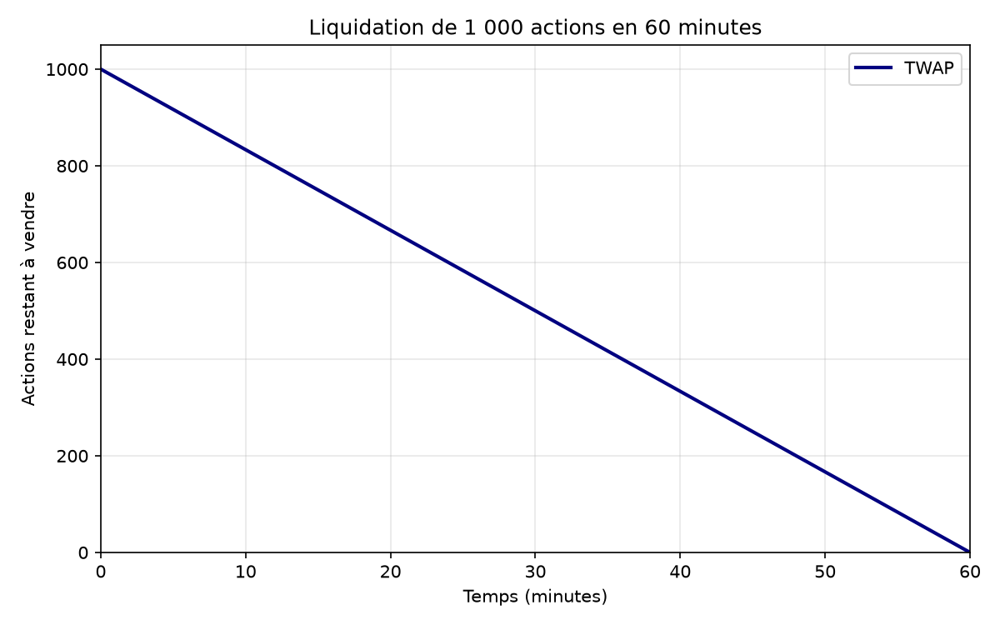

# Mean-Field Games for Optimal Execution

Work in progress: studying optimal execution and interactions between traders.

Currently implemented: a TWAP schedule selling 1,000 shares over 60 minutes.

Run: python src/twap.py

