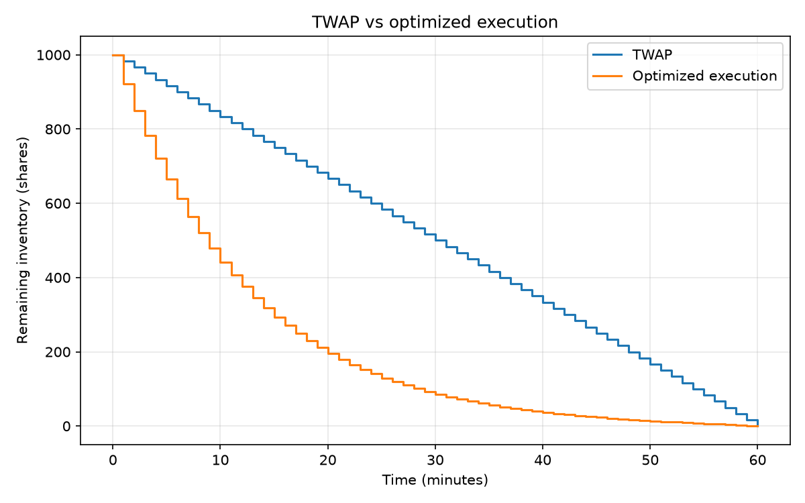
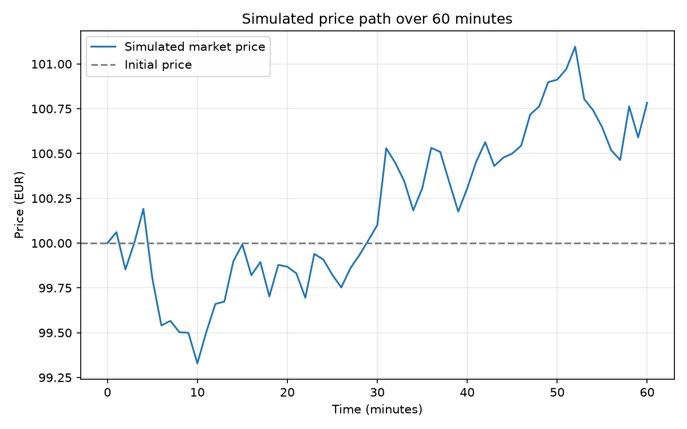
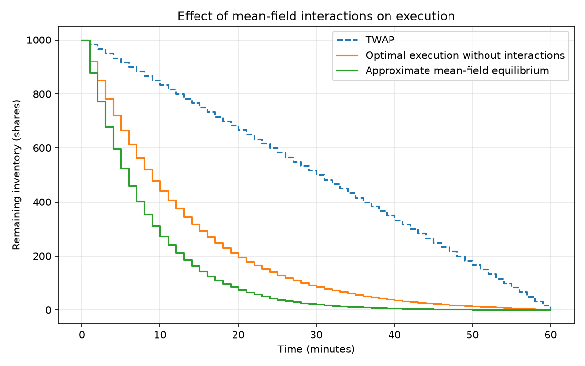
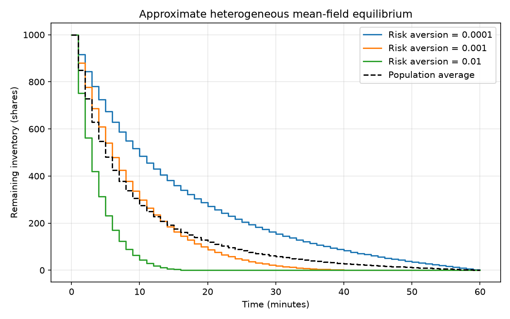
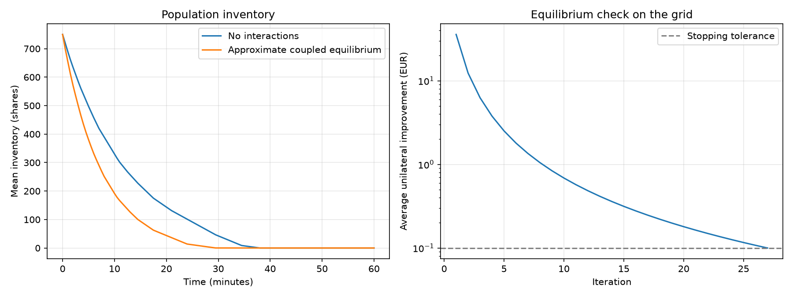
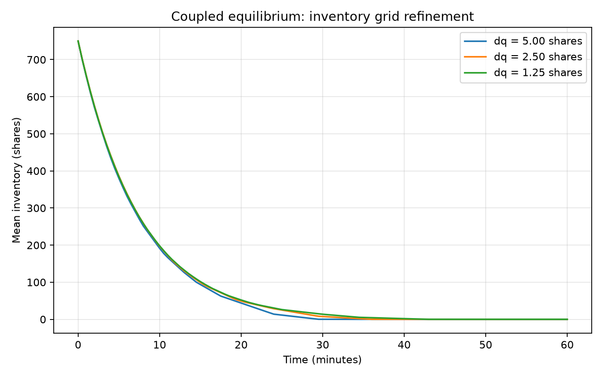

# Mean-Field Games for Optimal Execution

Work in progress. The project studies single-agent optimal execution
and approximate discrete-time mean-field equilibria, with homogeneous
and heterogeneous risk preferences.

## Model

A trader sells 1,000 shares over a maximum horizon of 60 minutes.

- Arithmetic Brownian market price with zero drift
- Initial price: EUR 100 per share
- Volatility: 0.20 EUR per square-root minute
- Linear temporary impact: execution price = market price - eta * trading rate
- Impact coefficient eta: 0.006 EUR * minute / share^2
- Sales occur at the end of each one-minute interval
- Fractional shares are allowed

Parameters are illustrative, not calibrated to market data.

## Strategies

1. TWAP: equal sales over 60 minutes.
2. Accelerated execution: equal sales over the first 30 minutes.
3. Optimized execution: a deterministic schedule minimizing expected
   implementation shortfall plus lambda times its variance.

Implementation shortfall is initial inventory times initial price minus
total execution revenue. A negative value means revenue exceeds this benchmark.

Risk aversion lambda is 0.001 per EUR.
The mean-variance score is a decision criterion, not an actual cash expense.

## Results

Monte Carlo evaluation uses 10,000 shared price paths with random seed 42.

| Strategy | Mean shortfall (EUR) | Standard deviation (EUR) | Mean-variance score (EUR) |
|---|---:|---:|---:|
| TWAP, 60 minutes | 101.19 | 898.73 | 908.91 |
| Accelerated, 30 minutes | 199.21 | 643.68 | 613.53 |
| Optimized | 243.91 | 512.71 | 506.78 |

The optimized schedule accepts higher expected impact costs to reduce
execution risk. It achieves the lowest score among these strategies
for the specified model and risk aversion.

The schedule is computed from model parameters, without using future
simulated prices.

## Validation

- TWAP theoretical mean shortfall: EUR 100.
- TWAP theoretical standard deviation: EUR 905.60.
- Simulated TWAP standard deviation: EUR 898.73.
- SLSQP optimization checked against the discrete analytical solution.
- Maximum difference per trade: approximately 0.000388 shares.
- Optimized theoretical score: EUR 510.360666.

Monte Carlo estimates fluctuate around theoretical values.

## Figures





## Installation

Requires Python 3 and the dependencies listed in requirements.txt.

    python3 -m venv .venv
    source .venv/bin/activate
    python -m pip install -r requirements.txt

## Run

From the project root:

    python src/twap.py
    python src/price_simulation.py
    python src/optimal_execution.py
    python src/monte_carlo.py

Figures are saved in the figures directory.

## Limitations and next steps

This is a simulation study, not a historical backtest.
The single-agent baseline excludes permanent impact.
The mean-field extension includes permanent impact from the population's
mean trading flow. Spreads, fees and order-book dynamics are not modeled.

Risk-aversion sensitivity and discrete mean-field interactions are implemented.
A coupled HJB/Fokker-Planck solver, PINNs, adaptive common-noise policies,
stochastic order flow and market making are not implemented.

## Discrete mean-field extension

Each trader chooses a deterministic, nonnegative liquidation schedule,
selling 1,000 shares over 60 one-minute intervals.

The expected market price at interval k is:

    E[S_k] = S_0 - gamma * cumulative_mean_sales_k

The population flow is normalized per trader, with gamma = 0.001 EUR/share.
Execution uses end-of-interval prices including that interval's collective
impact. Each infinitesimal trader treats the population flow as fixed
when optimizing an individual schedule.

Equilibria are approximated by damped best-response iteration.
The stopping criterion is a maximum discrepancy below 0.01 shares per
interval between the assumed flow and aggregate best responses.

### Homogeneous population

All traders have risk aversion 0.001 per EUR.

- Convergence in 46 iterations.
- Maximum fixed-point residual: 0.009490 shares per interval.
- First sale: 121.44 shares.
- Inventory after 30 minutes: 20.47 shares.
- Estimated unilateral improvement: approximately 0.00000112 EUR.



### Heterogeneous population

Three equally weighted groups differ only in risk aversion.

| Risk aversion (1/EUR) | First sale (shares) | Inventory at 30 min (shares) |
|---|---:|---:|
| 0.0001 | 83.22 | 154.33 |
| 0.001 | 119.36 | 18.87 |
| 0.01 | 248.60 | approximately 0 |

- Convergence in 45 iterations.
- Maximum aggregate residual: 0.008848 shares per interval.
- Estimated unilateral improvements against the realized aggregate flow:
  at most approximately 0.00000012 EUR across the three groups.

These are numerical checks for the specified parameters, not proofs
of equilibrium uniqueness or convergence for other parameter choices.
Deviation gains are solver-based estimates, not certified error bounds.



### Run the extensions

    python src/sensitivity.py
    python src/crowd_impact.py
    python src/mean_field.py
    python src/heterogeneous_mean_field.py

The current equilibrium solver operates on deterministic trading schedules.
It does not solve a coupled HJB/Fokker-Planck PDE system.

## Coupled Bellman and population transport solver

The project also includes a grid-based dynamic programming solver
coupled with forward population transport.

### Model and numerical method

- Initial inventories: 500, 750 and 1,000 shares, with respective
  population weights 25%, 50% and 25%.
- Trading horizon: 60 minutes; time step: 0.5 minute.
- Nonnegative selling rates and full liquidation at the terminal time.
- Constant selling rates within each time interval.
- Quadratic temporary impact and inventory risk penalties.
- Permanent price impact driven by the population mean selling rate.
- Backward Bellman optimization and mass-conserving forward transport.
- Iterative averaging of population strategies and their individual
  costs to compute an approximate equilibrium.

The stopping criterion is an average unilateral improvement below
EUR 0.10, evaluated with the population flow held fixed. This is an
average population criterion, not a worst-case bound for every trader.

### Numerical checks

The scripts check population mass conservation, nonnegative mass,
terminal liquidation, consistency between inventory and selling flow,
and agreement between the Bellman value and forward policy cost.

Inventory grid refinement, at a fixed time step of 0.5 minute:

| Inventory step (shares) | Iterations | Average deviation gain (EUR) | Mean inventory at 30 min | Population score (EUR) |
|---:|---:|---:|---:|---:|
| 5.00 | 27 | 0.099836 | 0.1124 | 611.578974 |
| 2.50 | 27 | 0.097310 | 7.5926 | 606.398965 |
| 1.25 | 27 | 0.098726 | 13.6756 | 606.204072 |

The maximum difference between successive mean inventory paths
decreases from 14.8099 to 6.6807 shares. The population score changes
by approximately 0.032% between the two finest grids, while late-stage
inventory remains sensitive to discretization.

These results document grid sensitivity at a fixed equilibrium
tolerance. They do not establish convergence to a continuous equilibrium.





### Reproduce

```bash
python src/check_bellman_transport.py
python src/coupled_bellman.py
python src/coupled_refinement.py
```

Refinement results are saved in `results/coupled_refinement.csv`.

### Scope

This implementation couples Bellman optimization with deterministic
inventory transport. Inventory dynamics contain no diffusion.
The population score averages individual execution objectives;
it is not a social-planner optimum.

The earlier end-of-interval execution models and this constant-rate
within-interval model use different execution timing conventions.

PINNs, adaptive common-noise policies, stochastic order arrivals,
market making and historical limit-order-book backtesting remain
future extensions.
