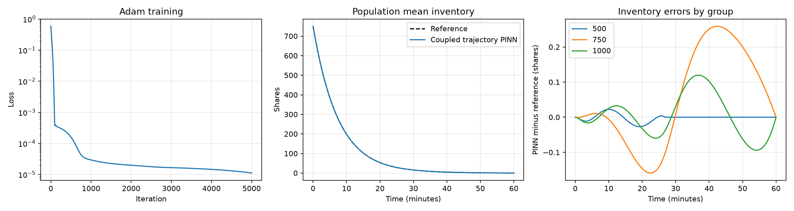
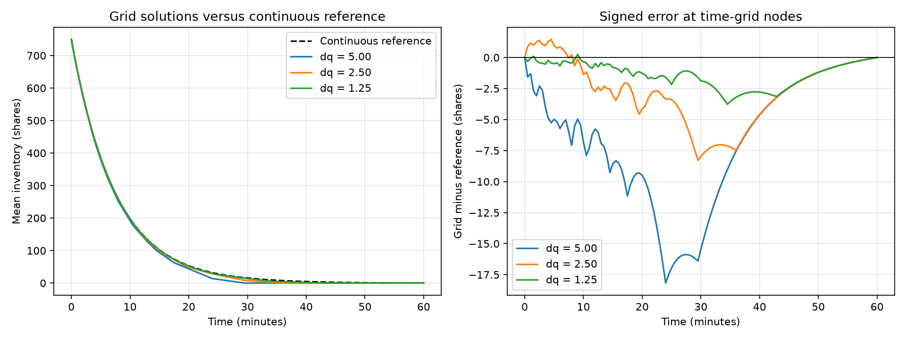

# Mean-Field Games for Optimal Execution

A quantitative research project studying how market impact, inventory
risk and interactions between traders affect optimal liquidation.

The project combines numerical optimization, Monte Carlo simulation,
Bellman dynamic programming, population transport and physics-informed
neural networks (PINNs). Numerical results are checked against analytical
or independently constructed continuous-time references.

## Main results

- Evaluated execution strategies on 10,000 shared simulated price paths.
- Computed homogeneous and heterogeneous discrete mean-field equilibria.
- Coupled backward Bellman optimization with mass-conserving population transport.
- Constructed a continuous-time equilibrium reference with early liquidation.
- Trained reduced HJB and trajectory PINNs without analytical training labels.
- Benchmarked the coupled trajectory PINN across three random seeds.
- Evaluated unilateral deviations using independent constrained optimization.



## Model

Traders liquidate inventory over a 60-minute horizon with nonnegative
selling rates and full terminal liquidation.

The continuous-time individual objective, with population flow held fixed, is

$$
J_i = \int_0^T
\left(\eta v_i(t)^2+\rho_i q_i(t)^2+
\gamma \bar v(t)q_i(t)\right)\,dt,
\qquad \dot q_i=-v_i.
$$

Here, eta controls temporary impact, rho_i is the inventory-risk
coefficient, and gamma controls permanent impact from the population's
mean selling rate. Each infinitesimal trader takes that mean flow as given.

Baseline parameters:
- Temporary impact: eta = 0.006.
- Price volatility: sigma = 0.20 EUR / sqrt(minute).
- Risk aversion: lambda = 0.001 / EUR, with rho = lambda * sigma².
- Permanent mean-flow impact: gamma = 0.001 EUR / share.
- Fractional share quantities are permitted.

The coupled Bellman and continuous trajectory benchmarks use initial
inventories of 500, 750 and 1,000 shares with weights 25%, 50% and 25%.
Their initial mean inventory is therefore 750 shares.

The earlier discrete heterogeneous model instead varies risk aversion
across traders initially holding 1,000 shares each.

## Execution baselines and Monte Carlo

Prices follow an arithmetic Brownian motion with zero drift.
Implementation shortfall is measured against liquidation at the initial
price without impact.

Results for 10,000 shared simulated paths, with 1,000 initial shares:

| Strategy | Mean shortfall (EUR) | Shortfall standard deviation (EUR) | Mean-variance score (EUR) |
|---|---:|---:|---:|
| TWAP, 60 minutes | 101.19 | 898.73 | 908.91 |
| Constant-rate liquidation, 30 minutes | 199.21 | 643.68 | 613.53 |
| Optimized discrete execution | 243.91 | 512.71 | 506.78 |

The score is mean shortfall plus lambda times shortfall variance.
Faster execution reduces price exposure at the expense of greater
temporary impact.

These simulations use end-of-interval sales. The later Bellman solver
uses constant selling rates within each interval and exact integration
of its interval costs. Their finite-step objective values therefore
use different timing conventions.

## Bellman and population transport

The grid solver combines backward dynamic programming with forward
transport of the inventory distribution. Checks include:

- Population mass conservation and nonnegative mass.
- Full terminal liquidation and inventory-flow consistency.
- Agreement between backward values and forward policy costs.
- Average unilateral improvement under a fixed population flow.
- Sensitivity to inventory-grid refinement.

The coupled iteration averages population strategies and their costs.
Its stopping tolerance is EUR 0.10 of average unilateral improvement.

### Comparison with the continuous reference

The continuous reference uses matrix exponentials and numerical boundary
matching. For the benchmark parameters, the 500-share group exits at
26.755455 minutes, while the other groups remain active until T.

Errors below concern population mean inventory at time-grid nodes,
with time step fixed at 0.5 minute:

| Inventory step (shares) | Maximum absolute error (shares) | RMSE (shares) |
|---|---:|---:|
| 5.00 | 18.1774 | 8.3605 |
| 2.50 | 8.3000 | 3.7504 |
| 1.25 | 3.7694 | 1.7076 |

Errors combine inventory discretization, time discretization and the
equilibrium stopping tolerance.



## Physics-informed neural networks

### Reduced single-agent HJB

Using the known structure V(t,q) = a(t)q², a neural network solves
the resulting Riccati equation. The terminal singularity is incorporated
analytically.

Across seeds 0, 1 and 42:
- Maximum sampled inventory error remains below 0.0144 shares.
- Integrated policy optimality gaps remain below 5.4e-7 EUR.
- A nonnegative optimality-gap identity agrees with direct cost
  differences to approximately 1.3e-10 EUR.

### Response to an imposed flow

A trajectory PINN jointly learns inventory and an early liquidation time
under a constant mean selling rate of 12.5 shares per minute.

For seed 42 and 1,000 initial shares:
- Learned liquidation time: 32.94600477 minutes.
- Analytical liquidation time: 32.94600715 minutes.
- Maximum sampled inventory error: 0.00119336 shares.
- Estimated integrated policy optimality gap: 1.37e-8 EUR.

### Coupled trajectory PINN

Three neural trajectories jointly satisfy the coupled optimality
conditions, with the population flow computed from their weighted sales.

| Seed | Maximum mean inventory error (shares) | Maximum group inventory error (shares) |
|---|---:|---:|
| 0 | 0.202080 | 0.329550 |
| 1 | 0.181926 | 0.345055 |
| 42 | 0.151026 | 0.258866 |

No buying was detected at the evaluation points.

Independent SLSQP best-response checks hold the population flow fixed
and evaluate piecewise-linear interpolations of the sampled trajectories.

At a 0.25-minute step:

| Seed | Average deviation gain (EUR) | Maximum group deviation gain (EUR) |
|---|---:|---:|
| 0 | 0.00011526 | 0.00019454 |
| 1 | 0.00011761 | 0.00021106 |
| 42 | 0.00010733 | 0.00018024 |

The maximum estimated gain remains below 0.000223 EUR across all
three seeds and both tested steps, 0.5 and 0.25 minute.

These are numerical diagnostics for the discretized deviations,
not certified bounds on continuous-time exploitability.

## Reproduce

Python 3.11 was used during development. From the repository root:

```bash
python3 -m venv .venv
source .venv/bin/activate
python -m pip install -r requirements.txt
```

Execution baselines:

```bash
python src/twap.py
python src/price_simulation.py
python src/optimal_execution.py
python src/monte_carlo.py
python src/sensitivity.py
```

Discrete mean-field models:

```bash
python src/crowd_impact.py
python src/mean_field.py
python src/heterogeneous_mean_field.py
```

Bellman and continuous-reference benchmarks:

```bash
python src/hjb_reference.py
python src/hjb_grid.py
python src/check_bellman_transport.py
python src/coupled_bellman.py
python src/coupled_refinement.py
python src/continuous_mean_field.py
python src/compare_continuous.py
```

Neural benchmarks and validation, in dependency order:

```bash
python src/pinn_hjb.py
python src/validate_pinn.py
python src/pinn_imposed_flow.py
python src/pinn_coupled.py
python src/check_coupled_seeds.py
python src/check_coupled_deviations.py
```

Run the continuous reference before the coupled neural benchmarks.
Figures are saved in `figures/`; numerical outputs in `results/`.
Generated model checkpoints are kept locally in the ignored `models/`
directory. Training results may vary with software and hardware.

## Interpretation and limitations

- This project studies optimal execution; market making is not implemented.
- The population dynamics use deterministic inventory transport, with no
  inventory diffusion.
- The neural solvers use reduced HJB or trajectory optimality equations;
  they do not solve a full coupled HJB/Fokker-Planck PDE system.
- The continuous reference and coupled PINN assume a particular active-set
  structure: the smallest-inventory group exits early and the others
  remain active until T. This is benchmark-specific.
- Three seeds were tested for one coupled parameter set; broad parameter
  robustness has not been established.
- Structural information is built into the neural parameterizations.
  Accuracy comparisons do not establish a general advantage over grid methods.
- Population scores average individual objectives; the equilibrium is
  not a social-planner optimum.
- No adaptive common-noise policies, stochastic order arrivals, historical
  order-book backtests or empirical market calibration are included.

The results demonstrate numerical consistency within the specified models,
rather than real-market trading performance.
